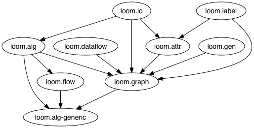

[](http://travis-ci.org/aysylu/loom)
[](https://cljdoc.org/d/aysylu/loom/CURRENT)

## Video and Slides

Watch the talk on Loom [at Clojure/West 2014](https://www.youtube.com/watch?v=wEEutxTYQQU) and view [slides](http://www.slideshare.net/aysylu/loom-at-clojurewest-32794616). Also, there's a video of the talk at [LispNYC](http://youtu.be/Iev7zavblqg) and [slides](http://www.slideshare.net/aysylu/aysylu-loom).

## Usage

### Leiningen/Clojars [group-id/name version]

[](http://clojars.org/aysylu/loom)

### Namespaces

    loom.graph   - records & constructors
    loom.alg     - algorithms (see also loom.alg-generic)
    loom.gen     - graph generators
    loom.attr    - graph attributes
    loom.label   - graph labels
    loom.io      - read, write, and view graphs in external formats
    loom.derived - derive graphs from existing graphs using maps and filters

### Documentation

[API Reference](https://cljdoc.org/d/aysylu/loom/CURRENT)

[Frequently Asked Questions](http://aysy.lu/loom/faq.html)

Feel free to join [Loom mailing list](https://groups.google.com/forum/#!forum/loom-clj) and ask any questions you may have.

### Basics

Create a graph:
```clojure
;; Initialize with any of: edges, adacency lists, nodes, other graphs
(def g (graph [1 2] [2 3] {3 [4] 5 [6 7]} 7 8 9))
(def dg (digraph g))
(def wg (weighted-graph {:a {:b 10 :c 20} :c {:d 30} :e {:b 5 :d 5}}))
(def wdg (weighted-digraph [:a :b 10] [:a :c 20] [:c :d 30] [:d :b 10]))
(def rwg (gen-rand (weighted-graph) 10 20 :max-weight 100))
(def fg (fly-graph :successors range :weight (constantly 77)))
```
If you have [GraphViz](http://www.graphviz.org) installed, and its binaries are in the path, you can view graphs with <code>loom.io/view</code>:
```clojure
(view wdg) ;opens image in default image viewer
```

Inspect:
```clojure
(nodes g)
=> #{1 2 3 4 5 6 7 8 9}

(edges wdg)
=> ([:a :c] [:a :b] [:c :d] [:d :b])

(successors g 3)
=> #{2 4}

(predecessors wdg :b)
=> #{:a :d}

(out-degree g 3)
=> 2

(in-degree wdg :b)
=> 2

(weight wg :a :c)
=> 20

(map (juxt graph? directed? weighted?) [g wdg])
=> ([true false false] [true true true])
```
Add/remove items (graphs are immutable, of course, so these return new graphs):
```clojure
(add-nodes g "foobar" {:name "baz"} [1 2 3])

(add-edges g [10 11] ["foobar" {:name "baz"}])

(add-edges wg [:e :f 40] [:f :g 50]) ;weighted edges

(remove-nodes g 1 2 3)

(remove-edges g [1 2] [2 3])

(subgraph g [5 6 7])
```
Traverse a graph:
```clojure
(bf-traverse g) ;lazy
=> (9 8 5 6 7 1 2 3 4)

(bf-traverse g 1)
=> (1 2 3 4)

(pre-traverse wdg) ;lazy
=> (:a :b :c :d)

(post-traverse wdg) ;not lazy
=> (:b :d :c :a)

(topsort wdg)
=> (:a :c :d :b)
```
Pathfinding:
```clojure
(bf-path g 1 4)
=> (1 2 3 4)

(bf-path-bi g 1 4) ;bidirectional, parallel
=> (1 2 3 4)

(dijkstra-path wg :a :d)
=> (:a :b :e :d)

(dijkstra-path-dist wg :a :d)
=> [(:a :b :e :d) 20]
```
Other stuff:
```clojure
(connected-components g)
=> [[1 2 3 4] [5 6 7] [8] [9]]

(bf-span wg :a)
=> {:c [:d], :b [:e], :a [:b :c]}

(pre-span wg :a)
=> {:a [:b], :b [:e], :e [:d], :d [:c]}

(dijkstra-span wg :a)
=> {:a {:b 10, :c 20}, :b {:e 15}, :e {:d 20}}
```
Attributes on nodes and edges:
```clojure
(def attr-graph (-> g
                (add-attr 1 :label "node 1")
                (add-attr 4 :label "node 4")
                (add-attr-to-nodes :parity "even" [2 4])
                (add-attr-to-edges :label "edge from node 5" [[5 6] [5 7]])))

; Return attribute value on node 1 with key :label
(attr attr-graph 1 :label)
=> "node 1"

; Return attribute value on node 2 with key :parity
(attr attr-graph 2 :parity)
=> "even"

; Getting an attribute that doesn't exist returns nil
(attr attr-graph 3 :label)
=> nil

; Return all attributes for node 4
; Two attributes found
(attrs attr-graph 4)
=> {:parity "even", :label "node 4"}

; Return attribute value for edge between nodes 5 and 6 with key :label
(attr attr-graph 5 6 :label)
=> "edge from node 5"

; Return all attributes for edge between nodes 5 and 7
(attrs attr-graph 5 7)
=> {:label "edge from node 5"}

; Getting an attribute that doesn't exist returns nil
(attrs attr-graph 3 4)
=> nil

; Remove the attribute of node 4 with key :label
(def attr-graph (remove-attr attr-graph 4 :label))

; Return all attributes for node 4
; One attribute found because the other has been removed
(attrs attr-graph 4)
=> {:parity "even"}
```
Derived graphs:
```clojure
; Build a derived graph using a node mapping
(nodes (mapped-by #(+ 10 %) g))
=> #{11 12 13 14 15 16 17 18 19}

; Subgraphs of g
(edges (nodes-filtered-by #{1 2 3 5} dg))
=> ([1 2] [2 1] [2 3] [3 2])

(edges (subgraph-reachable-from dg 1))
=> ([1 2] [2 1] [2 3] [3 2] [3 4] [4 3])
```
## Dependencies

Nothing but Clojure. There is optional support for visualization via [GraphViz](http://graphviz.org).

## TODO

See [Loom TODO board](https://trello.com/b/VgPZkvjP/loom-todo).

## Testing

```bash
lein test-all
```

## Contributors

Names in no particular order:

* [Justin Kramer](https://github.com/jkk/)
* [Aysylu Greenberg] (https://github.com/aysylu), [aysylu [dot] greenberg [at] gmail [dot] com](mailto:aysylu.greenberg@gmail.com), [@aysylu22](http://twitter.com/aysylu22)
* [Robert Lachlan](https://github.com/heffalump), [robertlachlan@gmail.com](mailto:robertlachlan@gmail.com)
* [Stephen Kockentiedt](https://github.com/s-k)

## Namespaces

The dependency graph of Loom's namespaces, generated by [lein-ns-dep-graph](https://github.com/hilverd/lein-ns-dep-graph).



## License

Copyright (C) 2010-2016 Aysylu Greenberg & Justin Kramer (jkkramer@gmail.com)

Distributed under the [Eclipse Public License](http://opensource.org/licenses/eclipse-1.0.php), the same as Clojure.
